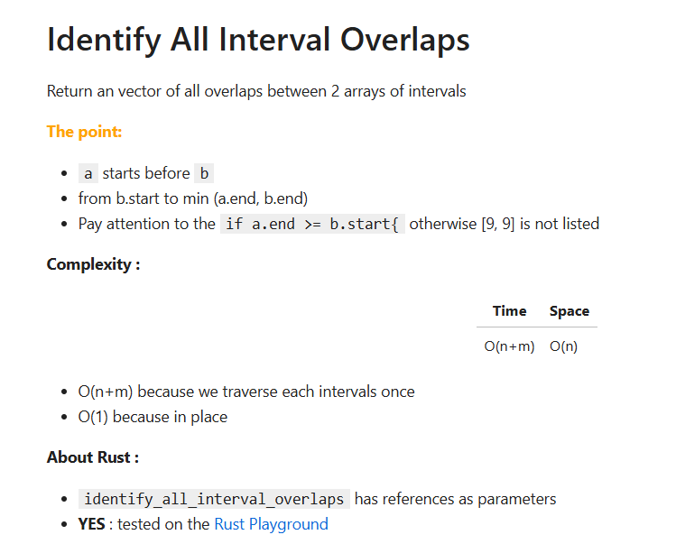
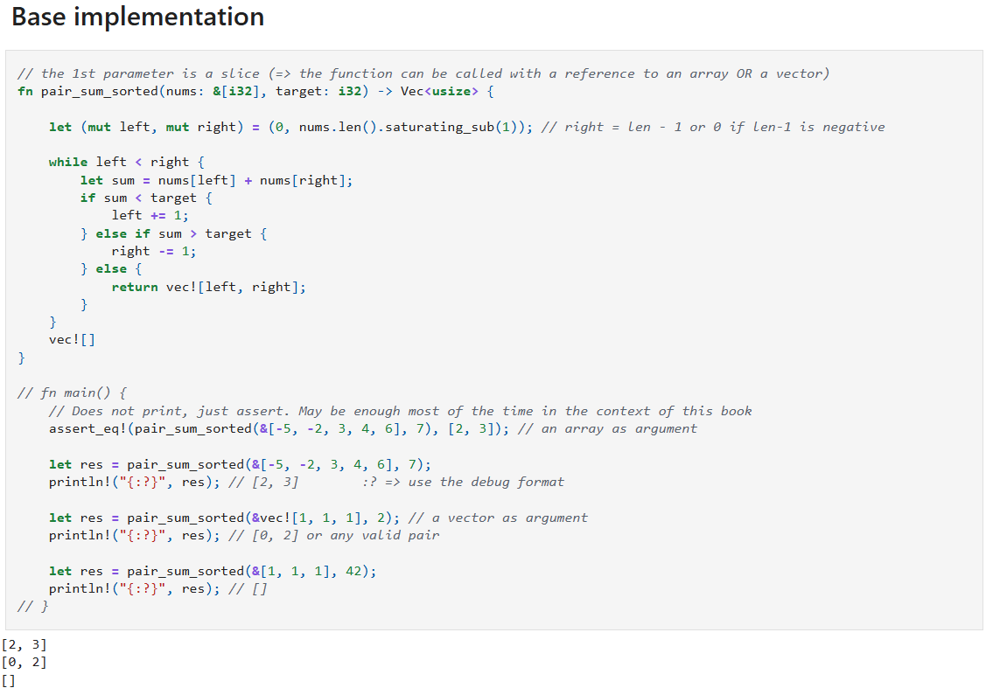

My notes in **Rust** from the book ISBN-10: [1736049135](https://amzn.eu/d/e3MFYEf) 

## How to
* One directory per chapter (01_two_pointers ... 19_math_and_geometry)
* In the directories, the number at the beginning of the filename (e.g., ``10_xxx.ipynb``, ``14_yyy.ipynb``) corresponds to the page number in the book.
* When the filename starts with `bonus_` the exercice is one of the ``bonus.pdf`` 
* A copy of ``bonus.pdf`` is available in the ``./assets`` directory
 

## In most notebooks
* I do **NOT** provide any explaination about the algorithm. Read the book.
* There is a recap of the challenge at the top of the page
* Then you will find the following sections
    * **The point** : The tip or the trick to keep in mind about the puzzle
    * **Complexity** : Recap of the time & space complexities
    * <b>TODO : </b>  This is mostly for me
    * **About Rust** :
        * You will find here a list of function calls, idioms, constructs...
        * There is no order, no priority
        * This is mostly for me since I'm learning Rust
        * I can repeat some items if I have trouble to keep them in mind
        * I usually confirm if the code of the cell has been executed in the [**Rust Playground**](https://play.rust-lang.org/)
    * There may be cells with code that doesn't work and I explain why
    * If there are multiple versions of the same solution I explain the changes from one version to the next.

## About the sample code
* All code examples are self-contained. By that, I mean that, unlike the code presented in the book or the associated [**GitHub repository**](https://github.com/ByteByteGoHq/coding-interview-patterns), they are not just isolated functions that are not necessarily easy to invoke. 
* For example, in [**Chapter 11**](https://github.com/40tude/rust_coding_interview/tree/main/11_trees), which covers binary trees, all the solutions I provide create the trees used in the chapter and display the results. The idea is really that each piece of code should be self-sufficient and easy to run.
* Yes, it results in more code, but I find it much more practical.
* In most of the code examples, I try to keep the names of functions, variables... identical to those in the book.

## What if you don't run Rust code in Jupyter Notebook
* Shame on you 😁. Read this [**README**](https://github.com/40tude/py_coding_interview/blob/main/README.md).
* You can copy and paste the code of the cell of interest either :
    1. In a local project on your PC 
    1. A better solution is to use the [**Rust Playground**](https://play.rust-lang.org/)
    1. In both cases, you may have to **uncomment** the line : ``fn main(){`` 

## This may help
* The page where I explain how to [**Use Rust in Jupyter Notebooks on Windows**](https://www.40tude.fr/docs/06_programmation/rust/001_rust_jupyter/rust_jupyter.html)
* [**My repo with code in Python**](https://github.com/40tude/py_coding_interview). 
    * In the [**README**](https://github.com/40tude/py_coding_interview/blob/main/README.md) I explain why I believe it is better to use Jupyter Notebooks in this learning context.
* The [**repo of the book**](https://github.com/ByteByteGoHq/coding-interview-patterns)

## About contributions
This project is developed for personal and educational purposes. Feel free to explore and use it to enhance your own learning in Rust and algorithm.

Given the nature of the project, external contributions are not actively sought nor encouraged. However, constructive feedback aimed at improving the project (in terms of speed, accuracy, comprehensiveness, etc.) is welcome. Please note that this project is being created as a hobby and is unlikely to be maintained once my initial goal has been achieved.